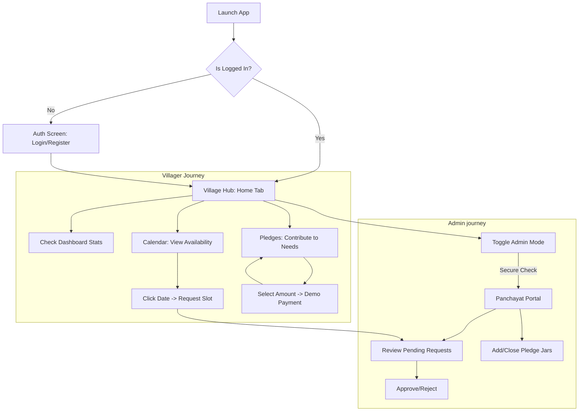

# Grama-Angana: Village Community Hub

Grama-Angana is a professional Android application designed for efficient community hall management and village maintenance tracking. It provides a synchronized platform for villagers and the Panchayat to interact, manage bookings, and contribute to local development.

---

## 💡 Problem Statement

**What problem does this project solve?**
In many rural areas and villages, managing community resources like public halls and tracking funds for local maintenance is often handled manually. This leads to inefficiencies, scheduling conflicts (double-bookings), and a lack of transparency in fund utilization. Villagers struggle to know when the community hall is available for events, and the Panchayat (local government) faces difficulties in coordinating bookings and collecting contributions for village development projects.

Grama-Angana solves this by providing a centralized digital platform where villagers can easily view hall availability, request bookings, and contribute to maintenance funds. Simultaneously, it empowers the Panchayat with a secure admin portal to approve requests, prevent conflicts, and manage community projects transparently.

---

## 📄 Product Requirements Document (PRD)

### 🎯 Objective
To digitalize village governance and community resource management, ensuring transparency in public hall bookings and collective funding for maintenance projects.

### 👥 User Personas
1.  **Villager**: Needs to check hall availability, request bookings for events, and contribute small amounts to community needs.
2.  **Panchayat (Admin)**: Needs to oversee all requests, approve/reject bookings to prevent conflicts, and manage the list of active maintenance projects.

### ✅ Functional Requirements
- **FR-01**: Secure registration and login for all community members.
- **FR-02**: A dynamic calendar showing real-time availability (Free, Busy, Full).
- **FR-03**: Atomic booking requests with precise time-slot selection.
- **FR-04**: Prevention of double-bookings via server-side transactions.
- **FR-05**: Maintenance tracking via "Funding Jars" with progress visualization.
- **FR-06**: Demo Payment Gateway for simulated community contributions.
- **FR-07**: Admin portal for request oversight and project management.

---

## 🚀 Key Features

### 📅 Advanced Hall Management
- **Interactive Calendar Engine**: A 7-column grid that dynamically aligns dates for every month.
- **Slot Conflict Protection**: System automatically blocks overlapping requests using Firestore Transactions.
- **Time-Picker Flow**: Users can specify exact event hours (e.g., 10:00 to 14:00).
- **Booking Status Tracking**: Real-time updates on "Pending," "Approved," and "Rejected" statuses.

### 💰 Community Pledges & Development
- **Visual Funding Jars**: Maintenance needs (e.g., "New Chairs") are shown as jars with dual-stage progress bars.
- **Custom Donations**: Support for any donation amount to empower collective development.
- **Demo Payment Flow**: Professional 256-bit encryption simulation for secure-looking contributions.

### 🔐 Security & Access Control
- **Firebase Auth**: Industry-standard email/password authentication.
- **Role-Based Access (RBAC)**: Management features are strictly restricted to the official Panchayat account.

---

## 🗺️ App Flow Chart

---

## 🛠️ Technologies Used
- **Frontend / UI Architecture**: Jetpack Compose (Material 3 Village Theme)
- **Language**: Kotlin 2.1.0 (KSP 2.0 Support)
- **Backend / BaaS**: Firebase Authentication & Firestore (Real-time Streams)
- **Local Persistence**: Room Database (Local Caching)
- **Architecture / Design Pattern**: MVVM with StateFlow and Repository Pattern

---

## ⚙️ Firebase Setup (Critical for Live Launch)

To ensure the app works properly, you **MUST** configure your Firebase Console:

1.  **Enable Authentication**: Go to **Authentication** > **Sign-in method** and enable **Email/Password**.
2.  **Firestore Rules**: Ensure rules allow authenticated users to read/write.
3.  **Admin Activation**: Register a user with `admin@gramaangana.com` and manually set their `role` to `"PANCHAYAT"` in the Firestore `users` document.

---

## 🔑 Official Admin Credentials

- **Email**: `admin@gramaangana.com`
- **Password**: `Panchayat123`
- *(This account has permanent hardcoded access to the Panchayat Portal)*

---

## 📦 Privacy & Git Security
The project uses a strict `.gitignore` to redact:
- `google-services.json` (Firebase keys)
- `local.properties` (Local SDK paths)
- Build artifacts and private IDE configurations.
